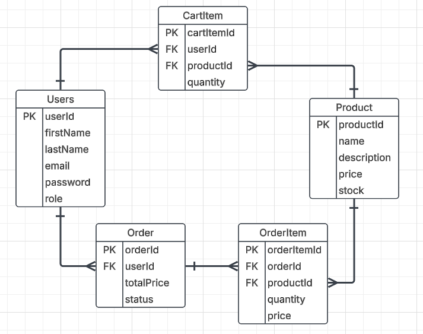

# E-Commerce API Project

- Due Date: Monday, March 24th, 2025
- All code for this project should be pushed to your personal repository in the Github Organization BEFORE presentations begin

## Project Description
This project involves building a simple e-commerce REST API using **Java, JDBC, Javalin, and PostgreSQL**. It implements essential functionality such as user authentication, product management, cart operations, and order processing. It will leverage different roles for Users (ADMIN or USER) to determine privileges, and user information will be stored in the Session.

## Project Presentation
A 5-10 minute presentation will be required to demonstrate your project. This will include leveraging an API testing tool, like Postman, to simulate variousr requests coming into your backend. You'll perform the functionality you've implemented and showcase your database afterwards to show that all changes have been persisted. Additionally, you'll show off logging and testing information for the project.

## Technologies Used
- **Java** (Core programming language)
- **JDBC** (Database interaction)
- **Javalin** (Lightweight web framework)
- **PostgreSQL** (Relational database)
    - AWS RDS preferred but local installation is fine
- **Postman** (For API testing)
- **Logback** (Logging Framework)
- **JUnit and Mockito** (Testing and Mocking Frameworks)

### **Entities & Field Requirements**

#### **User**
- `user_id` (Auto incrementing integer, primary key)
- `first_name` (String)
- `last_name` (String)
- `email` (String, unique)
- `password` (String)
- `role` (Enum: USER, ADMIN)

#### **Product**
- `product_id` (Auto incrementing integer, primary key)
- `name` (String)
- `description` (Text)
- `price` (Decimal)
- `stock` (Integer)

#### **CartItem**
- `cart_item_id` (Auto incrementing integer, primary key)
- `user_id` (Foreign key to User)
- `product_id` (Foreign key to Product)
- `quantity` (Integer)

#### **Order**
- `order_id` (Auto Incrementing integer, primary key)
- `user_id` (Foreign key to User)
- `total_price` (Decimal)
- `status` (Enum: PENDING, SHIPPED, DELIVERED)
- `created_at` (Timestamp) (optional)

#### **OrderItem**
- `order_item_id` (Auto incrementing integer, primary key)
- `order_id` (Foreign key to Order)
- `product_id` (Foreign key to Product)
- `quantity` (Integer)
- `price` (Decimal, snapshot of product price at purchase)

### Sample ERD

---

## **User Stories**

### **User Management**
- **As a user, I want to create an account so that I can log in and place orders.**
- **As a user, I want to log in so that I can access my account and make purchases.**
- **As a user, I want to update my account details (name, email, password) so that my information stays current.**
- **As a user, I want to view my order history so that I can track past purchases.**

### **Product Management**
- **As a user, I want to browse a list of available products so that I can find items to purchase.**
- **As a user, I want to view details of a specific product so that I can decide whether to buy it.**
- **As an admin, I want to add new products to the catalog so that users can purchase them.**
- **As an admin, I want to update product details (name, price, stock) so that the catalog remains accurate.**
- **As an admin, I want to delete products that are no longer available so that users do not see outdated listings.** 

### **Cart & Checkout**
- **As a user, I want to add products to my cart so that I can purchase multiple items at once.**
- **As a user, I want to remove products from my cart so that I can adjust my order before checkout.**
- **As a user, I want to update the quantity of products in my cart so that I can buy the right amount.**
- **As a user, I want to place an order so that I can purchase the items in my cart.**
- **As an admin, I want to view a list of all orders so that I can process them.**
- **As an admin, I want to update the status of an order (e.g., "Shipped", "Delivered") so that customers know their order progress.**
- **As an admin, I want to filter and search for orders based on status so that I can quickly find and manage them.**

### **Developer User Stories**
- **As a developer, I want to log events within the application for later processing or in the event of an error.**
- **As a developer, I want to create unit tests that cover the Service layer of the application, providing at least 80% coverage for methods in those classes**

---

## **Stretch Goals**

### **Advanced User Features**
- **As a user, I want to reset my password so that I can regain access if I forget it.**
- **As a user, I want to save multiple shipping addresses so that I can quickly choose where to send my orders.**
- **As a user, I want to leave a review and rating on a product so that others can see customer feedback.**

### **Enhanced Product & Order Management**
- **As an admin, I want to manage product categories so that products are easier to find.**

### **Cart & Checkout Improvements**
- **As a user, I want to apply discount codes to my order so that I can save money.**
- **As a user, I want to receive an email confirmation when I place an order so that I have a record of my purchase.**

### **Security & Performance**
- **As a developer, I want to use BCrypt to hash the passwords stored in the database to prevent them from being read as plaintext.**
